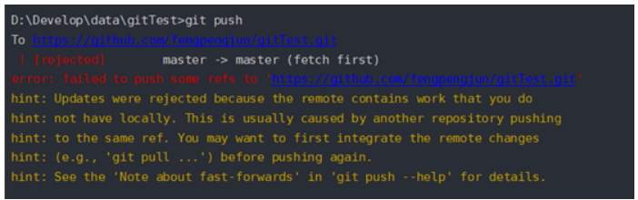

# git02

## 远程仓库

+ 将本地代码上传到远程仓库，方便共享管理
+ 公司内部有自己的远程仓库，公司一般使用gitLab，类似于github的界面，当是公司自己服务器

### 网络远程仓库

+ github
+ 码云

## 创建github远程仓库,推送代码

```js
git remote add origin 远程仓库地址// 给仓库起别名，orign是别名
git remote -v  //查看别名
git remote remove 别名//删除别名
git remote rename 别名  要修改的别名//修改别名

git push -u origin master //将代码添加到远程仓库分支上,第一次加-u后，会将本地仓库和远程仓库关联，以后直接git push 会自动找到分支
git push -f //强制推送
```

```js
git clone 远程仓库地址  //将远程库镜像下来 

'当clone时，会默认把远程仓库地址 起名为origin,且本地和远程仓库绑定了master分支'
```

+ 克隆下的代码不需要重新关联pust -u,可直接push

```js
git pull //将远程仓库的代码更新到本地
```


## 配置用户权限

+ ssh流程
  1. 客户端会生成两个密钥，公钥和私钥
  2. 把公钥给远程仓库
  3. 本地上传代码，是基于私钥进行加密的
  4. 远程仓库收到请求后，基于对公钥进行验证
  5. 远程仓库验证通过后运行上传代码

```js
ssh-keygen -t rsa -C "远程仓库邮箱地址"   //生成两个密钥
```

+ 这两个密钥在本地都会生成文件，git会提示它们的地址
+ 如果是个人远程仓库，可直接将公钥添加到个人github中
+ 如果远程仓库是其它人的，需要将公钥发给他人。


## 分支

### 概念

1. 一个分支一个业务
2. 测试项目时一般以某一个分支为基准进行测试
3. 有时代码出现bug，此时可创建一个分支，专门用来处理bug

### 操作本地分支

```js
git branch //查看分支，默认1个 master是主分支

git branch 分支名称 //创建分支，以最新的版本为基准，是一份独立代码

git checkout 分支名称 //切换分支，切换之前需要先提交代码commit

git merge 分支名称 //合并分支，将当前分支和 分支名称 的代码 合并

git branch -d 分支名称 //-d,合并后才可删除

git branch -D 分支名称 //-D,没有合并也会强制删除

git checkout -b 分支名称 //创建分支并切换到分支

//修改分支名，如果对于分支不是当前分支，可以使用下面代码：
git branch -m 原分支名 新分支名
//如果是当前，那么可以使用加上新名字
git branch -m 新分支名称
```

### 操作远程分支

```js
git branch -r //查看所有远程分支
git branch -a //查看所有远程，本地分支
git branch -vv //查看远程仓库和本地仓库的关联

git oush origin -delete 分支名 //删除远程分支


git branch -u origin/master //建立当前分支与远程分支的映射关系

git checkout dev origin/dev  //创建分支dev并和远程origin/dev分支惯量，本地dev分支的初始代码和远程的dev分支代码一样

git branch --unset-upstream //撤销本地分支与远程分支的映射关系

git push -u origin 本地分支名 //将本地分支推送到远程分支
```


## 协作模式

+ 远程仓库是共享的，所有项目研究者共享相同的远程仓库，这种协作模式下造成冲突的情况较大

+ 第二种协作模式

  + 每个研发者都有自己独有的分支

  + 专门有人负责合并研发这分支的代码到主分支

  + 每个研发者可以拉去主分支代码，但是没有推送权限

    如果没有推送权限，那么研发者的分支是如何推送到负责推送到主分支人的手中？是在创建一个每个人的分支远程仓库吗？


## 注意

1. 如果a推送到远程仓库之后，b需要先pull更新，在去推送push
2. 场景：a先修改了文件index文件第2行，并推送到了远程仓库，b也修改了index文件的第2行，此时b也推送到远程仓库，b客户端的git会提示（master|MERGING），代码冲突。
   - 此冲突需要手动协商解决，保证功能的合理性
3. 分支合并时也会产生冲突，只要合并就会产生冲突
4. 不要勾选  __不公开邮箱__ ,否则可能会造成没有权限

## 单词

```js
remote //远程
rename //别名
origin //起点
clone	//克隆
pull 	//拉
keygen //注册机
rsa //对密钥的算法
branch  //分支
merge  //合并
```


## ？

1. 问题1：

   

   + 为什么会出现？
     + 有a和b两个开发者，当a push推送到远程仓库并且代码版本更新，此时开发者b也要push 推送到远程仓库，就会出现此错误
   + 原因
     + 因为开发者b的本地仓库版本落后于远程仓库的版本号了
   + 解决
     + 需要重新pull拉取一下远仓，当时此时就会出现问题2


1. 问题2：当从远程仓库pull到本地仓库时出现

   + ```js
     Merge branch 'master' of gitee.com:xing-wenhang/xingwenhang
     # Please enter a commit message to explain why this merge is necessary,
     # especially if it merges an updated upstream into a topic branch.
     #
     # Lines starting with '#' will be ignored, and an empty message aborts
     # the commit.
     ~
         
     即：请输入提交消息来解释为什么这种合并是必要的
     ```

   + 原因：

     + 因为本地仓库版本落后于远程仓库的版本号了

   + 解决

     1. 方案1：

        + 如果要写解释，如果不写解释就直接3，4

          ```
          1.按键盘字母 i 进入insert模式
          
          2.修改最上面那行黄色合并信息,可以不修改
          
          3.按键盘左上角"Esc"
          
          4.输入" :wq",冒号+wq,按回车键即可
          
          ```

     2. 方案2:

        + 在每次推送代码之前，直接使用  拉取合并新的变动到本地。git pull --rebase

          

     

2. 分支的详解

   官方文档：

   

   

3. git主分支可以删除吗，如果可以那么删除git主分支,重新设置主分支。

     可以删除，远程仓库的主分支默认为master，无法删除，需要进入远程仓库修改主分支才可删除。

   

4. 场景：当a开发者工作一段时间后，老板说要改一个bug，a开发者创建并切换了分支去改bug，此时突然发现你刚才修改的文件还没有add，那么修改的文件还会处于切换分支前的状态吗？

   - 修改的文件只要没有add到暂存区就不会变

   

5. Fast Forward 和 no fast foward ，fetch+merge是什么？ 

   + fast forward:通常合并分支时，如果没有分歧解决，就会直接移动文件指针。
   + no fast foward ：使用--no-ff之后，在合并时会生成 一个新的commit,这样可查看出分支信息。

   
